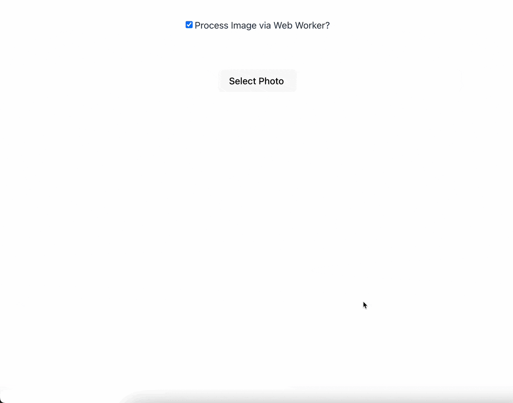

# Offscreen Canvas + Web Worker

## Introduction

| Desktop Experience                          | Mobile Experience (Android)                 | Mobile Experience (iOS)             |
| ------------------------------------------- | ------------------------------------------- | ----------------------------------- |
|  |  |  |

This respository will showcase enabling media selection from disk for desktop visitors and media capture or selection for mobile visitors. It also showcases how image processing (resizing and compressing) can be offloaded to a dedicated web worker thread for better performance.

The media selection and capture is fulfilled by leveraging the `capture` attribute on HTML file inputs to allow mobile users to capture media directly. When triggered, the file input opens the device’s camera app for media capture, and once confirmed, the user is returned to the application with the file input populated with the new media.

With modern devices capturing increasingly higher resolution images, file sizes have grown significantly. This poses a challenge for applications that need to upload multiple images while maintaining a fast and responsive user experience. The Canvas API can be used to process images to make them better candidates for transfer, however, performing these operations on the main thread can cause the browser’s UI to freeze until processing is complete. To solve this, web workers are used to move image processing to a separate thread, ensuring the browser remains responsive while processing happens in the background.

## Instructions

These instructions assume you are running a version of Node.js equal to or greater than the version mentioned in the `.nvmrc` file and have pnpm installed:

1. Install dependencies across all packages and applications in the monorepo

```bash
pnpm install
```

2. Start the application

```bash
pnpm dev
```

## Further Reading

### HTML `capture` attribute

- [HTML attribute: capture](https://developer.mozilla.org/en-US/docs/Web/HTML/Attributes/capture)
- [HTML Media Capture Examples](https://addpipe.com/html-media-capture-demo/)
- [TIL: You Can Access A User’s Camera with Just HTML](https://austingil.com/html-capture-attribute/)

### Image processing

- [An overview of web workers](https://web.dev/learn/performance/web-worker-overview?hl=en)
- [Use web workers to run JavaScript off the browser's main thread](https://web.dev/articles/off-main-thread?hl=en)
- [Speed up your canvas operations with a web worker](https://developer.mozilla.org/en-US/docs/Web/API/OffscreenCanvas)
- [Offscreen Canvas API](https://developer.mozilla.org/en-US/docs/Web/API/OffscreenCanvas)

### Working with files

- [Using files from web applications](https://developer.mozilla.org/en-US/docs/Web/API/File_API/Using_files_from_web_applications)
- [`createObjectURL` method](https://developer.mozilla.org/en-US/docs/Web/API/URL/createObjectURL_static)
